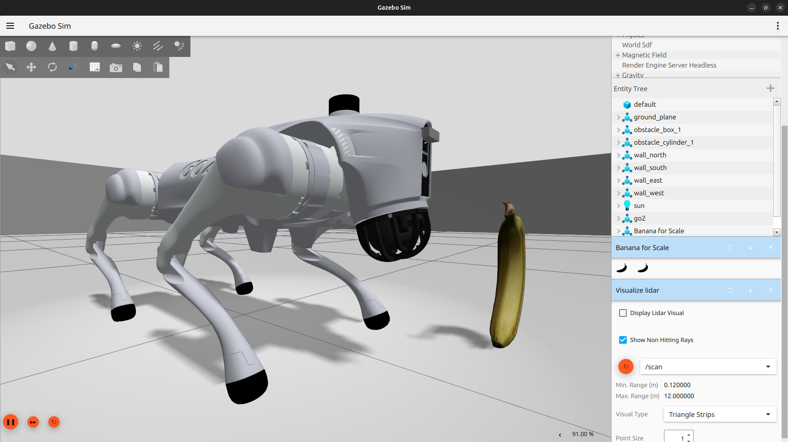
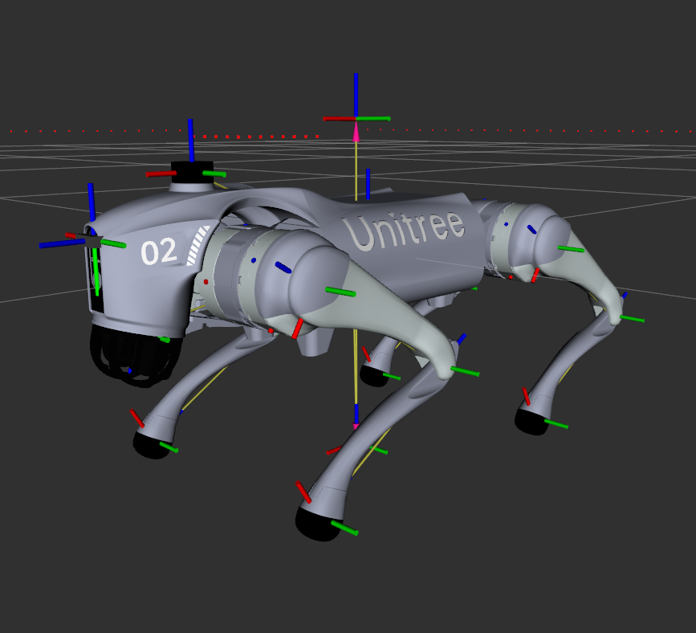

# go2-quadruped-sim

A complete ROS 2 Jazzy simulation package for the Unitree Go2 quadruped robot, featuring autonomous navigation, SLAM mapping, and a CHAMP-based locomotion controller. Designed for educational use and as a foundation for robotics research and development.


*Unitree Go2 in Gazebo Harmonic simulation environment*


*RViz showing robot model, sensor data, and navigation visualization*

## Features

- **Full Gazebo Harmonic Simulation**: Physics-accurate simulation with Gazebo Harmonic (gz-sim)
- **CHAMP Locomotion Controller**: Quadruped gait generation with inverse kinematics
- **Dynamic Body Pose Control**: Real-time body orientation and height adjustment (6-DOF)
- **Nav2 Integration**: Autonomous navigation with dynamic path planning
- **SLAM Mapping**: Real-time map building with SLAM Toolbox
- **Multiple Test Environments**: Pre-configured worlds for different scenarios
- **ROS 2 Jazzy**: Built for the latest ROS 2 LTS release

## System Requirements

- **Operating System**: Ubuntu 24.04 (Noble Numbat)
- **ROS Distribution**: ROS 2 Jazzy Jalisco
- **Simulator**: Gazebo Harmonic
- **Hardware**: Recommended 8GB RAM, 4+ CPU cores

## Installation

### 1. Install ROS 2 Jazzy

If you haven't installed ROS 2 Jazzy yet, follow the [official installation guide](https://docs.ros.org/en/jazzy/Installation/Ubuntu-Install-Debs.html):

```bash
# Set up sources
sudo apt update && sudo apt install software-properties-common
sudo add-apt-repository universe
sudo apt update && sudo apt install curl -y
sudo curl -sSL https://raw.githubusercontent.com/ros/rosdistro/master/ros.key -o /usr/share/keyrings/ros-archive-keyring.gpg
echo "deb [arch=$(dpkg --print-architecture) signed-by=/usr/share/keyrings/ros-archive-keyring.gpg] http://packages.ros.org/ros2/ubuntu $(. /etc/os-release && echo $UBUNTU_CODENAME) main" | sudo tee /etc/apt/sources.list.d/ros2.list > /dev/null

# Install ROS 2 Jazzy Desktop
sudo apt update
sudo apt install ros-jazzy-desktop
```

### 2. Install Gazebo Harmonic

```bash
sudo apt install gz-harmonic
```

### 3. Install Dependencies

```bash
sudo apt install \
  ros-jazzy-navigation2 \
  ros-jazzy-nav2-bringup \
  ros-jazzy-slam-toolbox \
  ros-jazzy-ros-gz \
  ros-jazzy-ros-gz-sim \
  ros-jazzy-ros-gz-bridge \
  ros-jazzy-gz-ros2-control \
  ros-jazzy-robot-localization \
  ros-jazzy-rosbridge-suite \
  ros-jazzy-joint-state-publisher \
  ros-jazzy-joint-state-publisher-gui \
  ros-jazzy-xacro \
  python3-colcon-common-extensions
```

### 4. Build the Workspace

```bash
# Clone the repository
cd ~
git clone https://github.com/AOShei/go2-quadruped-sim.git
cd go2-quadruped-sim

# Build all packages
colcon build

# Source the workspace
source install/setup.bash
```

## Quick Start

### Launch Full Simulation

```bash
source install/setup.bash
ros2 launch unitree_go2_nav2 simulation.launch.py
```

This will start:
- Gazebo Harmonic with the Go2 robot
- SLAM Toolbox for mapping
- Nav2 for autonomous navigation
- RViz2 for visualization

## Controlling the Robot

There are two main ways to control the Go2 robot in simulation:

### Method 1: Autonomous Navigation with Nav2 (Recommended for Beginners)

The easiest way to move the robot is using Nav2's goal-based navigation in RViz:

1. **Launch the full simulation** (if not already running):
   ```bash
   source install/setup.bash
   ros2 launch unitree_go2_nav2 simulation.launch.py
   ```

2. **Set a navigation goal in RViz2**:
   - Click the **"Nav2 Goal"** button in the RViz toolbar (or press `G`)
   - Click on the map where you want the robot to go
   - Drag to set the desired orientation (direction the robot should face)
   - Release to send the goal

3. **Watch the robot navigate**:
   - Nav2 will automatically plan a path (shown as a green line)
   - The robot will avoid obstacles using the LiDAR sensor
   - The local costmap (colored grid) shows detected obstacles
   - SLAM Toolbox simultaneously builds the map as the robot explores

**Tips**:
- Start with nearby goals to see the robot in action
- The robot moves at ~0.5 m/s maximum speed (tuned for stability)
- If the robot gets stuck, set a new goal or wait for recovery behaviors
- The map will gradually improve as the robot explores more area

### Method 2: Manual Teleoperation

For direct control, use keyboard teleoperation:

1. **Install teleop_twist_keyboard** (if not already installed):
   ```bash
   sudo apt install ros-jazzy-teleop-twist-keyboard
   ```

2. **Launch teleoperation in a new terminal**:
   ```bash
   source install/setup.bash
   ros2 run teleop_twist_keyboard teleop_twist_keyboard
   ```

3. **Control the robot with keyboard**:
   - **`i`** - Move forward
   - **`k`** - Stop
   - **`,`** - Move backward
   - **`j`** - Turn left
   - **`l`** - Turn right
   - **`u`** / **`o`** - Move diagonally
   - **`q`** / **`z`** - Increase/decrease max speeds
   - **`w`** / **`x`** - Increase/decrease only linear speed
   - **`e`** / **`c`** - Increase/decrease only angular speed

**Note**: Keep the teleop terminal focused (active window) for keyboard control to work.

### Method 3: Programmatic Control (Advanced)

Send velocity commands directly via topic:

```bash
# Move forward at 0.2 m/s
ros2 topic pub /cmd_vel geometry_msgs/msg/Twist "{linear: {x: 0.2, y: 0.0, z: 0.0}, angular: {x: 0.0, y: 0.0, z: 0.0}}"

# Turn in place (0.3 rad/s counterclockwise)
ros2 topic pub /cmd_vel geometry_msgs/msg/Twist "{linear: {x: 0.0}, angular: {z: 0.3}}"

# Stop the robot
ros2 topic pub /cmd_vel geometry_msgs/msg/Twist "{linear: {x: 0.0}, angular: {z: 0.0}}"
```

Or write your own Python/C++ node that publishes to `/cmd_vel` (type: `geometry_msgs/msg/Twist`).

### Quick Reference: Control Topics

| Topic | Message Type | Purpose | Example |
|-------|--------------|---------|---------|
| `/cmd_vel` | `geometry_msgs/Twist` | Velocity control (walking) | `"{linear: {x: 0.2}}"` |
| `/body_pose` | `unitree_go2_msgs/Pose` | Body orientation/height | `"{z: 0.05, pitch: 0.1}"` |

Both topics can be used simultaneously for advanced control scenarios.

## Advanced Control: Body Pose Adjustment

One of the powerful features of the CHAMP-based controller is **dynamic body pose control**. This allows you to adjust the robot's body orientation and height while standing or walking, which is essential for:
- Navigating uneven terrain or slopes
- Climbing stairs or ramps
- Demonstrating the controller's stability capabilities
- Research on legged locomotion and balance

### Body Pose Commands

The controller subscribes to `/body_pose` (type: `unitree_go2_msgs/msg/Pose`) with 6 degrees of freedom:

**Translation (meters):**
- `x` - Forward/backward body shift
- `y` - Left/right body shift
- `z` - Height adjustment (relative to nominal height)

**Rotation (radians):**
- `roll` - Tilt left/right
- `pitch` - Tilt forward/backward
- `yaw` - Rotate body (while feet stay planted)

### Example Body Pose Commands

```bash
# Raise the body by 5cm (good for obstacles)
ros2 topic pub /body_pose unitree_go2_msgs/msg/Pose "{z: 0.05}"

# Lower the body by 3cm (more stable stance)
ros2 topic pub /body_pose unitree_go2_msgs/msg/Pose "{z: -0.03}"

# Tilt forward (pitch down, useful for climbing)
ros2 topic pub /body_pose unitree_go2_msgs/msg/Pose "{pitch: 0.15}"

# Tilt backward (pitch up)
ros2 topic pub /body_pose unitree_go2_msgs/msg/Pose "{pitch: -0.15}"

# Roll left (tilt sideways)
ros2 topic pub /body_pose unitree_go2_msgs/msg/Pose "{roll: 0.2}"

# Combine height and pitch (simulating climbing pose)
ros2 topic pub /body_pose unitree_go2_msgs/msg/Pose "{z: -0.02, pitch: 0.2}"

# Reset to neutral pose
ros2 topic pub /body_pose unitree_go2_msgs/msg/Pose "{x: 0.0, y: 0.0, z: 0.0, roll: 0.0, pitch: 0.0, yaw: 0.0}"
```

### Body Pose While Walking

**Important**: Body pose adjustments work in real-time and can be applied while the robot is moving! Try these:

```bash
# First, start the robot walking forward
ros2 topic pub /cmd_vel geometry_msgs/msg/Twist "{linear: {x: 0.2}}"

# Then in another terminal, tilt the body forward while walking
ros2 topic pub /body_pose unitree_go2_msgs/msg/Pose "{pitch: 0.1}"

# Or adjust height while moving
ros2 topic pub /body_pose unitree_go2_msgs/msg/Pose "{z: 0.03}"
```

### Demonstrating Stability

To showcase the controller's stability and adaptability:

1. **Static Stability Test**: Command different body orientations while standing
   ```bash
   # Try various roll/pitch angles to see the legs compensate
   ros2 topic pub /body_pose unitree_go2_msgs/msg/Pose "{roll: 0.15, pitch: 0.1}"
   ```

2. **Dynamic Stability Test**: Walk with adjusted body pose
   ```bash
   # Walk forward with lowered stance
   ros2 topic pub /cmd_vel geometry_msgs/msg/Twist "{linear: {x: 0.15}}" &
   ros2 topic pub /body_pose unitree_go2_msgs/msg/Pose "{z: -0.05}"
   ```

3. **Terrain Adaptation Simulation**: Add world with ramps/stairs and adjust pitch
   ```bash
   # When approaching an incline, pitch forward
   ros2 topic pub /body_pose unitree_go2_msgs/msg/Pose "{pitch: 0.15, z: -0.02}"
   ```

### Practical Limits

For stable operation, stay within these ranges:
- **Height (z)**: ±0.08m from nominal (default 0.225m)
- **Pitch/Roll**: ±0.3 radians (~±17 degrees)
- **X/Y Translation**: ±0.05m

Exceeding these limits may cause inverse kinematics failures or instability.

### Automated Body Pose Demo

Want to see all the body pose capabilities in action? Run the automated demo script:

```bash
# Make sure the simulation is running first
ros2 launch unitree_go2_nav2 simulation.launch.py

# In a new terminal, run the demo
source install/setup.bash
ros2 run unitree_go2_nav2 body_pose_demo
```

The demo will automatically cycle through various poses including:
- Height adjustments (raising and lowering)
- Forward and backward pitch (climbing poses)
- Left and right roll (sideways tilt)
- Combined movements

Watch the robot in Gazebo or RViz as it demonstrates its stability and range of motion!

## Package Overview

This workspace contains four ROS 2 packages:

### [unitree_go2_description](src/unitree_go2_description/)
Robot URDF/xacro model with Gazebo Harmonic integration.
- Complete kinematic model (12 DOF)
- Sensors: IMU, 2D LiDAR (270°)
- Realistic mass and inertia properties

### [unitree_go2_controller](src/unitree_go2_controller/)
CHAMP-based quadruped locomotion controller.
- Inverse kinematics solver
- Gait generation (trot, walk, etc.)
- Body pose stabilization
- Odometry estimation

### [unitree_go2_nav2](src/unitree_go2_nav2/)
Navigation and simulation launch files.
- Full simulation stack integration
- SLAM and localization modes
- Multiple pre-configured worlds
- Nav2 parameter tuning for quadrupeds

### [unitree_go2_msgs](src/unitree_go2_msgs/)
Custom message definitions.
- `Pose`: 6-DOF body pose commands
- `Velocities`: 3-DOF velocity commands

## Usage Examples

### Launch Without RViz

```bash
ros2 launch unitree_go2_nav2 simulation.launch.py use_rviz:=false
```

### Use Localization Mode (Requires Existing Map)

```bash
ros2 launch unitree_go2_nav2 simulation.launch.py use_slam:=false map:=/path/to/map.yaml
```

### Visualize Robot Model Only

```bash
ros2 launch unitree_go2_description display.launch.py
```

### Save a Map

After running SLAM and mapping an environment:

```bash
ros2 run nav2_map_server map_saver_cli -f my_map
```

## Development

### Build Individual Packages

```bash
colcon build --packages-select unitree_go2_description
colcon build --packages-select unitree_go2_controller
colcon build --packages-select unitree_go2_msgs
colcon build --packages-select unitree_go2_nav2
```

### View Topics

```bash
# List all active topics
ros2 topic list

# Monitor odometry
ros2 topic echo /odom

# Monitor laser scans
ros2 topic echo /scan
```

### Adjust Gait Parameters

Edit `src/unitree_go2_controller/config/kinematics_config.yaml`:

```yaml
gait.swing_height: 0.04      # Foot lift height (meters)
gait.stance_duration: 0.25   # Stance phase duration (seconds)
gait.nominal_height: 0.225   # Default body height (meters)
```

## Documentation

- **[CLAUDE.md](CLAUDE.md)**: Technical documentation for Claude Code AI assistant
- **[CREDITS.md](CREDITS.md)**: Attribution and licensing information
- **Package READMEs**: See individual package directories for detailed documentation

## Troubleshooting

### Robot Doesn't Move

1. Check if the controller is running:
   ```bash
   ros2 node list | grep quadruped_controller
   ```

2. Verify velocity commands are being received:
   ```bash
   ros2 topic echo /cmd_vel
   ```

### Poor SLAM Performance

Increase the transform tolerance in `src/unitree_go2_nav2/config/nav2_sim_params_minimal.yaml`:

```yaml
bt_navigator:
  ros__parameters:
    transform_tolerance: 3.0  # Increase if needed
```

### Gazebo Crashes or Won't Start

Ensure Gazebo Harmonic is properly installed:

```bash
gz sim --version  # Should show Gazebo Harmonic
```

### Build Errors

Clean and rebuild:

```bash
rm -rf build/ install/ log/
colcon build
```

## Contributing

Contributions are welcome! This project is designed for educational use and as a jumping-off point for further development.

### Potential Enhancements

- Additional gait patterns
- Terrain adaptation algorithms
- Advanced sensor integration
- Real robot hardware interface
- Multi-robot simulation

## License

This project is licensed under the **BSD-3-Clause License**. See [LICENSE](LICENSE) for details.

### Third-Party Acknowledgments

This project incorporates code from:
- **CHAMP** by Juan Miguel Jimeno (BSD-3-Clause)
- **Unitree Go2** robot assets from Unitree Robotics (BSD-3-Clause)

See [CREDITS.md](CREDITS.md) for complete attribution information.

## Citation

If you use this simulation in your research, please cite:

```bibtex
@software{go2_quadruped_sim,
  author = {O'Shei, Andrew},
  title = {go2-quadruped-sim: Unitree Go2 ROS 2 Simulation},
  year = {2024-2025},
  url = {https://github.com/AOShei/go2-quadruped-sim}
}
```

## Acknowledgments

Special thanks to:
- **Juan Miguel Jimeno** for the CHAMP quadruped controller framework
- **Unitree Robotics** for the Go2 robot and specifications
- The **ROS 2** and **Gazebo** communities

---

**Educational Use**: This simulation is specifically designed for learning robotics, testing algorithms, and developing new features for quadruped robots.
